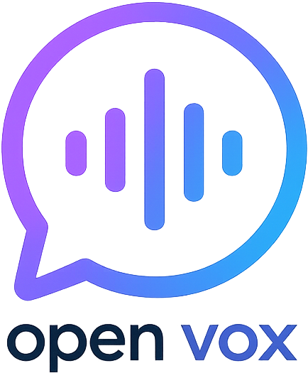

<p align="center">
  
</p>

# OpenVox

Petit utilitaire de bureau, **open source** et **multi-OS**, façon « OpenWhisper inversé » :
on **sélectionne du texte n'importe où**, on appuie sur un **raccourci clavier global**, et
l'application le **lit à voix haute** avec une voix clonée par **XTTS v2, 100 % en local**.

- Aucune API cloud, aucune clé, aucune télémétrie. Tout tourne hors-ligne (après le
  téléchargement initial du modèle, ~1,8 Go).
- GUI minimale en **Tkinter** (stdlib) pour gérer les voix, la langue et l'accélération,
  avec **mode clair / sombre** et **interface en français, anglais ou espagnol**.
- L'app vit en **tâche de fond** avec une **icône de zone de notification**.

## Fonctionnement

1. **Au démarrage** : lecture de `config.json` → chargement du modèle XTTS (CPU par défaut,
   GPU CUDA en option) → enregistrement du raccourci → fenêtre + icône tray.
2. **Au raccourci** (`Ctrl+Alt+S` par défaut) : sauvegarde du presse-papiers → copie simulée
   (`Ctrl+C`, ou `Cmd+C` sur macOS) → lecture du texte → restauration du presse-papiers →
   synthèse XTTS avec la voix active → lecture audio. **`Ctrl+Alt+X` stoppe** la lecture.

Les deux raccourcis sont **modifiables depuis la fenêtre** (section « Raccourcis » → bouton
« Modifier », puis on appuie sur la combinaison voulue ; `Échap` pour annuler).

## Installation

> ⚠️ **Python 3.10 obligatoire** (pas 3.11+) — la seule version proprement supportée par `coqui-tts==0.27.5`.

```bash
# 1. Environnement virtuel avec Python 3.10
py -3.10 -m venv .venv          # Windows  (ou : "C:\Python310\python.exe" -m venv .venv)
.venv\Scripts\activate          # Windows
# source .venv/bin/activate     # macOS / Linux

# 2. (GPU NVIDIA uniquement) torch CUDA EN PREMIER, sinon sautez cette ligne :
pip install torch==2.5.1 torchaudio==2.5.1 --index-url https://download.pytorch.org/whl/cu121

# 3. Le reste des dépendances :
pip install -r requirements.txt

# 4. Lancer :
python main.py
```

### Lancement en un clic

Une fois l'installation faite, plus besoin du terminal :
- double-clic sur **`run.bat`** (à la racine), ou
- exécute une fois `create_shortcut.ps1` (clic droit → « Exécuter avec PowerShell ») pour
  poser un raccourci **OpenVox** sur le Bureau, avec l'icône, qui lance l'app sans console.

### CPU vs GPU

- **Par défaut, tout tourne sur CPU** (lent : plusieurs secondes par phrase, mais marche partout).
- Pour le **GPU NVIDIA**, installez la build CUDA de `torch` (étape 2 ci-dessus) **avant**
  `requirements.txt`, puis passez le réglage **Accélération** sur `cuda` (ou `auto`) dans la GUI.
- Le réglage ne fait que choisir le périphérique au chargement ; si CUDA est demandé mais absent,
  l'app retombe automatiquement sur CPU avec un message clair.
- Le changement d'**Accélération** prend effet au redémarrage : le bouton **« ↻ Redémarrer
  l'application »** (ou l'entrée **Redémarrer** du menu de la zone de notification) le fait pour vous.

## Gérer les voix

XTTS fait du **clonage zero-shot** : aucun entraînement.

- Une « voix » = **un échantillon `.wav` propre** (~15–40 s, mono, 22–24 kHz, sans bruit de fond).
- **Importer** depuis la GUI copie le fichier dans `voices/` et l'enregistre dans `config.json`.
- **Changer de voix** = la sélectionner dans la liste déroulante.
- **Supprimer** une voix = bouton « Supprimer » (avec confirmation) ; le fichier est retiré de
  `voices/` et, si c'était la voix active, elle est désactivée.

Conversion d'un fichier au bon format avec ffmpeg :
```bash
ffmpeg -i source.mp3 -ac 1 -ar 22050 -sample_fmt s16 reference.wav
```

## Spécificités par OS

- **Windows** (cible de dev) : RAS, `pynput` fonctionne sans droits administrateur.
- **macOS** : autoriser **Accessibilité** + **Surveillance des saisies** ; `Cmd+C` au lieu de
  `Ctrl+C` (géré automatiquement) ; pas d'accélération GPU garantie → CPU.
- **Linux** : OK sous **X11**. Sous **Wayland**, le raccourci global et la copie simulée sont
  souvent bloqués par le compositeur (limitation connue).

## Structure

```
main.py     # assemble GUI + moteur + raccourci + tray
engine.py   # XTTS : chargement, voix, synthèse en streaming (2 threads)
gui.py      # fenêtre Tkinter : voix, langue, accélération, statut
hotkey.py   # raccourci global, copie simulée, presse-papiers (Tkinter)
config.py   # lecture/écriture de config.json
config.json # voix active, raccourcis, langue, device (édité par la GUI)
assets/     # logo et icônes (logo.png, icon.png, icon.ico)
voices/     # échantillons .wav importés (non versionnés)
```

À l'import, un échantillon trop long (> 40 s) est automatiquement ramené en mono et
**redécoupé sur un extrait central de ~30 s** (au-delà, l'embedding XTTS se dilue).

## Licences

- Le **code** est sous licence **MIT** (voir `LICENSE`).
- ⚠️ Les **poids du modèle XTTS-v2** sont sous **Coqui Public Model License (CPML)**, à usage
  **non commercial**. À vérifier avant tout usage commercial.
